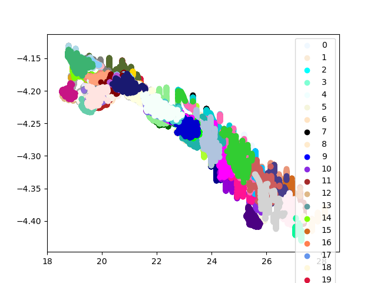

# dpmd-tools

A collection of utilities aimed mainly at manipulating deep MD datasets

Contains tools:
* compare E-V plots for reference data and predictions
* plot data coverage in E-V space
* batch recompute script that does computations on specified remote hosts
* trajectory optimizer to find spacegroup of strcuctures along trajectory
* Oganov fingerprint clustering and selection for datasets
* constrain based filtering of dataset structures - supports iterative dataset
  growing
* upload_script that copies dataset files from local to remote server and neatly
  organizes the

Needs to be installed in appropriate conda environment that has DeePMD-Kit
installed! Use the environment files or install deepmd-kit from conda into
the base environment.

# Install

The package must be installed in order for the submodules to be importable.
Otherwise some scripts will not work.

```
pip install git+https://github.com/ftl-fmfi/dpmd_tools.git -e
```

# Example

100 clusters found in ge136 MetaD trajectory by `data_cluster.py`. For 300K
136 atomstructures, fingerprinting takes roughly 2 hours and clustering is a
matter of minutes.

